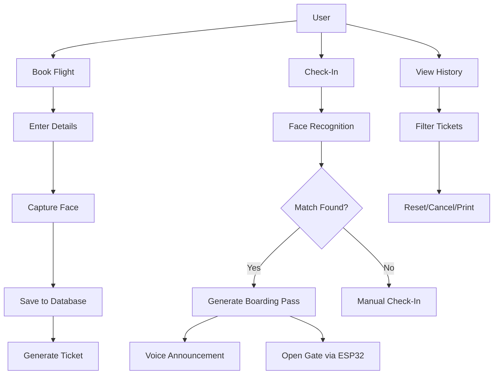
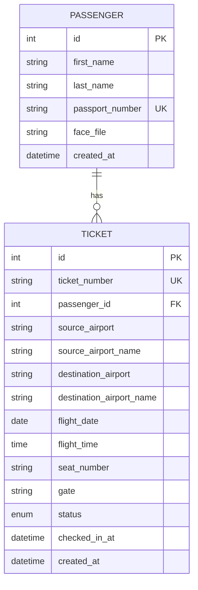

# Flight Kiosk System - Complete Project Documentation

> **Project Name:** Flight Ticketing Kiosk System  
> **Version:** 1.0.0  
> **Platform:** Python Desktop Application (Linux/Windows)  
> **Last Updated:** January 2026

---

## 📋 Table of Contents

1. [Project Overview](#1-project-overview)
2. [System Architecture](#2-system-architecture)
3. [Features & Capabilities](#3-features--capabilities)
4. [Technology Stack](#4-technology-stack)
5. [Project Structure](#5-project-structure)
6. [Database Design](#6-database-design)
7. [Core Services](#7-core-services)
8. [GUI Components](#8-gui-components)
9. [ESP32 Hardware Integration](#9-esp32-hardware-integration)
10. [Installation & Setup](#10-installation--setup)
11. [Configuration](#11-configuration)
12. [Development Timeline](#12-development-timeline)
13. [Security Features](#13-security-features)
14. [Future Enhancements](#14-future-enhancements)

---

## 1. Project Overview

### 1.1 What is the Flight Kiosk System?

The Flight Kiosk System is a **self-service flight ticketing and check-in terminal** built as a Python desktop application. It simulates a real-world airport kiosk that allows passengers to:

- **Book flights** with airport search functionality
- **Capture their face** during the booking process
- **Check-in using face recognition** technology
- **Receive boarding passes** (PDF generation) with voice announcements
- **Manage ticket history** with admin capabilities

### 1.2 Key Highlights

| Feature | Description |
|---------|-------------|
| 🎫 **Flight Booking** | Multi-step booking with fuzzy airport search |
| 📸 **Face Capture** | Auto-capture passenger face using webcam |
| 🛂 **Face Recognition Check-In** | Biometric verification for secure check-in |
| 🎟️ **Boarding Pass Generation** | Professional PDF with QR code |
| 🔊 **Voice Announcements** | Natural TTS using Microsoft Edge voices |
| 🔌 **ESP32 Integration** | Hardware gate control via MQTT/Serial |
| 🌙 **Modern Dark UI** | Airline-themed dark mode with neon cyan accents |

### 1.3 Target Use Case

This project was developed as a **Final Year Project** demonstrating:
- Desktop application development with Python
- Face recognition and biometric authentication
- IoT hardware integration (ESP32)
- Database management with SQLAlchemy
- Modern GUI design with CustomTkinter

---

## 2. System Architecture

### 2.1 High-Level Architecture

```
┌─────────────────────────────────────────────────────────────────┐
│                     Flight Kiosk System                         │
├─────────────────────────────────────────────────────────────────┤
│                                                                 │
│  ┌─────────────────────────────────────────────────────────┐   │
│  │                    PRESENTATION LAYER                    │   │
│  │  ┌─────────┐ ┌─────────┐ ┌─────────┐ ┌─────────────┐   │   │
│  │  │ Booking │ │Check-In │ │ History │ │  Dashboard  │   │   │
│  │  │  View   │ │  View   │ │  View   │ │    View     │   │   │
│  │  └─────────┘ └─────────┘ └─────────┘ └─────────────┘   │   │
│  │                     ↓ CustomTkinter ↓                    │   │
│  └─────────────────────────────────────────────────────────┘   │
│                              ↓                                  │
│  ┌─────────────────────────────────────────────────────────┐   │
│  │                    SERVICE LAYER                         │   │
│  │  ┌───────────┐ ┌───────────┐ ┌────────────────────┐    │   │
│  │  │   Face    │ │   Voice   │ │  Boarding Pass     │    │   │
│  │  │  Service  │ │  Service  │ │     Service        │    │   │
│  │  └───────────┘ └───────────┘ └────────────────────┘    │   │
│  │  ┌───────────┐ ┌───────────┐ ┌────────────────────┐    │   │
│  │  │   ESP32   │ │  Airport  │ │     Audit          │    │   │
│  │  │  Service  │ │  Service  │ │    Service         │    │   │
│  │  └───────────┘ └───────────┘ └────────────────────┘    │   │
│  └─────────────────────────────────────────────────────────┘   │
│                              ↓                                  │
│  ┌─────────────────────────────────────────────────────────┐   │
│  │                    DATA LAYER                            │   │
│  │  ┌───────────────────────────────────────────────────┐  │   │
│  │  │              SQLite Database                       │  │   │
│  │  │   ┌─────────────┐      ┌─────────────────────┐   │  │   │
│  │  │   │  Passengers │ ←──→ │      Tickets        │   │  │   │
│  │  │   └─────────────┘      └─────────────────────┘   │  │   │
│  │  └───────────────────────────────────────────────────┘  │   │
│  └─────────────────────────────────────────────────────────┘   │
│                              ↓                                  │
│  ┌─────────────────────────────────────────────────────────┐   │
│  │                   EXTERNAL SYSTEMS                       │   │
│  │  ┌───────────┐ ┌───────────┐ ┌────────────────────┐    │   │
│  │  │  ESP32    │ │  Webcam   │ │    File System     │    │   │
│  │  │  (Gate)   │ │  (OpenCV) │ │ (Faces, PDFs, Logs)│    │   │
│  │  └───────────┘ └───────────┘ └────────────────────┘    │   │
│  └─────────────────────────────────────────────────────────┘   │
│                                                                 │
└─────────────────────────────────────────────────────────────────┘
```

### 2.2 Data Flow



---

## 3. Features & Capabilities

### 3.1 Flight Booking Module

The booking process follows a **3-step wizard**:

| Step | Description | Components |
|------|-------------|------------|
| **Step 1** | Flight Details | Source & destination airports, flight date & time |
| **Step 2** | Passenger Details | Name, passport number, face capture |
| **Step 3** | Confirmation | Booking summary with ticket number |

**Key Capabilities:**
- ✅ Fuzzy airport search with IATA codes
- ✅ Date picker with validation (no past dates)
- ✅ Time slot selection (multiple options per route)
- ✅ Real-time face detection with auto-capture
- ✅ Face stability detection (30 frames before capture)
- ✅ Automatic ticket number generation (TK-XXXXXX)

### 3.2 Face Recognition Check-In

The check-in module provides **biometric authentication**:

- **Face Detection:** Uses MediaPipe for real-time face detection
- **Face Recognition:** Uses face_recognition library for encoding/matching
- **Confidence Display:** Shows match confidence percentage
- **Auto Check-In:** Automatically processes when face is recognized
- **Manual Fallback:** Ticket number entry for manual check-in

**Recognition Threshold:** 55% minimum confidence (configurable)

### 3.3 Boarding Pass Generation

Professional PDF boarding passes include:

- Passenger name and passport number
- Flight route (source → destination)
- Flight date and time
- Gate and seat assignment
- QR code for ticket verification
- Airline branding and styling

### 3.4 Voice Announcements

Natural-sounding announcements using **Microsoft Edge TTS**:

```
"Attention passenger John Smith. 
Your boarding pass is ready. 
Please proceed to Gate B7 for your flight departing at 14:30. 
Your seat number is 12A. 
Have a pleasant flight."
```

Features:
- Airport chime sound before announcement
- Natural female voice (en-US-AriaNeural)
- Non-blocking audio playback
- Configurable voice and speed

### 3.5 History & Management

The history view provides:

- **Filter Options:** All, Booked, Checked-In, Cancelled
- **Statistics Display:** Total, booked, checked-in counts
- **Ticket Cards:** Color-coded status indicators
- **Admin Functions:** Reset check-in, delete passenger
- **Print Option:** Reprint boarding passes

### 3.6 Dashboard Analytics

Real-time statistics including:

- Today's bookings count
- Today's check-ins count
- Cancellation statistics
- Recent activity log with timestamps
- Quick stats cards with visual indicators

---

## 4. Technology Stack

### 4.1 Core Technologies

| Category | Technology | Version | Purpose |
|----------|------------|---------|---------|
| **Language** | Python | 3.10+ | Core programming language |
| **GUI Framework** | CustomTkinter | 5.2.0+ | Modern UI components |
| **Database** | SQLite + SQLAlchemy | 2.0.0+ | Data persistence & ORM |
| **Computer Vision** | OpenCV | 4.8.0+ | Camera access & image processing |
| **Face Detection** | MediaPipe | 0.10.0+ | Real-time face detection |
| **Face Recognition** | face_recognition | 1.3.0+ | Face encoding & matching |
| **TTS Engine** | Edge-TTS | 6.1.0+ | Text-to-speech announcements |
| **PDF Generation** | ReportLab | 4.0.0+ | Boarding pass PDFs |
| **QR Codes** | qrcode | 7.0+ | Ticket QR code generation |

### 4.2 Hardware Integration

| Component | Technology | Purpose |
|-----------|------------|---------|
| **ESP32/ESP8266** | Arduino | Gate controller |
| **MQTT** | paho-mqtt | Wireless communication |
| **Serial** | pyserial | USB communication |

### 4.3 Additional Libraries

| Library | Purpose |
|---------|---------|
| `rapidfuzz` | Fuzzy string matching for airport search |
| `cryptography` | Encryption of face data |
| `Pillow` | Image processing |
| `numpy` | Numerical operations |
| `tkcalendar` | Date picker widget |
| `pygame` | Audio playback |

---

## 5. Project Structure

```
FinalProject/
├── README.md                    # Project overview
├── DOCUMENTATION.md             # This file
├── test_esp.py                  # ESP32 connection tester
├── .gitignore                   # Git ignore rules
│
├── data/                        # Runtime data (gitignored)
│   ├── tickets.db              # SQLite database
│   ├── audit.log               # Audit trail
│   ├── .encryption_key         # Face encryption key
│   ├── faces/                  # Encrypted face encodings
│   └── boarding_passes/        # Generated PDF passes
│
├── desktop_app/                 # Main application
│   ├── main.py                 # Entry point
│   ├── config.py               # Configuration settings
│   ├── requirements.txt        # Python dependencies
│   │
│   ├── gui/                    # GUI components
│   │   ├── __init__.py
│   │   ├── app.py              # Main application window
│   │   ├── theme.py            # Theme configuration
│   │   ├── booking_view.py     # Booking interface
│   │   ├── checkin_view.py     # Check-in interface
│   │   ├── history_view.py     # History/management
│   │   ├── dashboard_view.py   # Analytics dashboard
│   │   └── components/         # Reusable UI components
│   │       ├── admin_modal.py        # Admin PIN dialog
│   │       ├── airport_selector.py   # Airport picker
│   │       ├── camera_widget.py      # Camera display
│   │       ├── modal_confirm.py      # Confirmation dialogs
│   │       ├── modal_selector.py     # List selector
│   │       ├── modal_ticket_detail.py # Ticket details
│   │       └── ticket_card.py        # Ticket display card
│   │
│   ├── services/               # Business logic
│   │   ├── __init__.py
│   │   ├── face_service.py     # Face detection/recognition
│   │   ├── voice_service.py    # TTS announcements
│   │   ├── esp_service.py      # ESP32 communication
│   │   ├── boarding_pass_service.py  # PDF generation
│   │   ├── airport_service.py  # Airport data & search
│   │   ├── audit_service.py    # Action logging
│   │   ├── sound_service.py    # Sound effects
│   │   └── encryption_service.py     # Face data encryption
│   │
│   ├── database/               # Data layer
│   │   ├── __init__.py
│   │   ├── models.py           # SQLAlchemy models
│   │   └── db_manager.py       # Database operations
│   │
│   └── assets/                 # Static assets
│       └── sounds/             # Audio files
│           └── airportsound.mp3
│
└── esp32/                       # Hardware firmware
    └── gate_controller/
        └── gate_controller.ino  # Arduino sketch
```

---

## 6. Database Design

### 6.1 Entity Relationship Diagram



### 6.2 Passenger Model

```python
class Passenger(Base):
    __tablename__ = "passengers"
    
    id = Column(Integer, primary_key=True)
    first_name = Column(String(100), nullable=False)
    last_name = Column(String(100), nullable=False)
    passport_number = Column(String(20), unique=True, nullable=False)
    face_file = Column(String(255), nullable=True)
    created_at = Column(DateTime, default=datetime.utcnow)
    
    # Relationship
    tickets = relationship("Ticket", back_populates="passenger", cascade="all, delete-orphan")
```

### 6.3 Ticket Model

```python
class TicketStatus(PyEnum):
    BOOKED = "booked"
    CHECKED_IN = "checked_in"
    CANCELLED = "cancelled"

class Ticket(Base):
    __tablename__ = "tickets"
    
    id = Column(Integer, primary_key=True)
    ticket_number = Column(String(10), unique=True)  # TK-A1B2C3
    passenger_id = Column(Integer, ForeignKey("passengers.id"))
    
    # Flight details
    source_airport = Column(String(10))       # IATA code
    source_airport_name = Column(String(200))
    destination_airport = Column(String(10))
    destination_airport_name = Column(String(200))
    flight_date = Column(Date)
    flight_time = Column(Time)
    
    # Check-in details (generated during check-in)
    seat_number = Column(String(5))   # e.g., "12A"
    gate = Column(String(5))          # e.g., "B7"
    
    # Status tracking
    status = Column(Enum(TicketStatus), default=TicketStatus.BOOKED)
    checked_in_at = Column(DateTime, nullable=True)
    created_at = Column(DateTime, default=datetime.utcnow)
```

### 6.4 Key Database Operations

| Operation | Method | Description |
|-----------|--------|-------------|
| Create booking | `db.create_ticket()` | Creates passenger and ticket |
| Check-in | `db.check_in_ticket()` | Updates status, assigns seat/gate |
| Cancel | `db.cancel_ticket()` | Sets status to CANCELLED |
| Reset | `db.reset_ticket_checkin()` | Resets to BOOKED status |
| Cleanup | `db.cleanup_old_checkins()` | Resets 24hr+ old check-ins |

---

## 7. Core Services

### 7.1 Face Service

**File:** `services/face_service.py`

Handles all face-related operations:

| Method | Description |
|--------|-------------|
| `detect_faces(frame)` | Detect faces using MediaPipe |
| `get_face_encoding(frame)` | Extract 128-d face encoding |
| `save_face_encoding(encoding, passenger_id)` | Save encrypted encoding |
| `load_all_encodings(passengers)` | Load all encodings for matching |
| `recognize_face(frame, known_encodings)` | Match face against known faces |
| `is_face_centered(face, width, height)` | Check if face is centered |

**Face Recognition Pipeline:**
1. Capture frame from webcam
2. Detect faces using MediaPipe
3. Extract face encoding using face_recognition
4. Encrypt and save to file
5. During check-in, compare against stored encodings
6. Return matching passenger with confidence score

### 7.2 ESP32 Service

**File:** `services/esp_service.py`

Manages ESP32 communication via MQTT or Serial:

| Command | Description |
|---------|-------------|
| `OPEN_GATE` | Opens the physical gate |
| `CLOSE_GATE` | Closes the gate |
| `LED_GREEN` | Success indication |
| `LED_RED` | Error indication |
| `LED_BLUE` | Scanning indication |
| `BUZZER_SUCCESS` | Success sound |
| `BUZZER_ERROR` | Error sound |

**Connection Methods:**
- **MQTT (WiFi):** Connects to MQTT broker for wireless control
- **Serial (USB):** Direct USB connection at 9600 baud

### 7.3 Voice Service

**File:** `services/voice_service.py`

Provides text-to-speech announcements:

| Method | Description |
|--------|-------------|
| `speak(text, blocking)` | Speak any text |
| `announce_boarding(...)` | Make boarding announcement |
| `generate_speech(text, path)` | Generate audio file |

**Uses Microsoft Edge TTS** for natural-sounding voice (en-US-AriaNeural).

### 7.4 Boarding Pass Service

**File:** `services/boarding_pass_service.py`

Generates professional PDF boarding passes:

- ReportLab for PDF creation
- QR code embedded with ticket data
- Airline-themed styling (dark blue, cyan accents)
- A4 size output
- Auto-opens in default PDF viewer

### 7.5 Airport Service

**File:** `services/airport_service.py`

Provides airport data and search:

- 100+ Iraqi and international airports
- Fuzzy search using rapidfuzz
- IATA code lookup
- Popular airports highlighted

### 7.6 Audit Service

**File:** `services/audit_service.py`

Logs all significant actions:

| Event Type | Logged Data |
|------------|-------------|
| BOOKING | Ticket number, passenger, route |
| CHECKIN_SUCCESS | Ticket, passenger |
| CHECKIN_FAILED | Ticket, passenger |
| RESET_CHECKIN | Ticket, admin |
| CANCEL | Ticket, reason |
| SESSION_TIMEOUT | Auto-reset event |
| ADMIN_ACCESS | Action, success/denied |
| DELETE_PASSENGER | Passenger, passport |

---

## 8. GUI Components

### 8.1 Theme System

**File:** `gui/theme.py`

The application uses a **modern dark airline theme**:

| Color | Hex | Purpose |
|-------|-----|---------|
| Primary BG | `#05070a` | Main background |
| Secondary BG | `#0d1117` | Sidebar, cards |
| Accent | `#00f2ff` | Neon cyan highlights |
| Success | `#00ff88` | Green status |
| Error | `#ff3366` | Red status |
| Warning | `#ffcc00` | Amber alerts |

**Typography:**
- Heading: Segoe UI Display, 28-40px, Bold
- Body: Segoe UI, 13-18px
- Caption: Segoe UI, 11px

### 8.2 Main Application Window

**File:** `gui/app.py`

Features:
- Fullscreen mode (F11 to toggle)
- Sidebar navigation with keyboard shortcuts
- Session timeout (2 minutes inactivity)
- ESP32 status indicator
- Modal overlay system
- Mouse scroll handling for Linux

**Keyboard Shortcuts:**
| Key | Action |
|-----|--------|
| F1 | Book Flight |
| F2 | Check-In |
| F3 | History |
| F4 | Dashboard |
| Escape | Exit fullscreen / Home |
| F11 | Toggle fullscreen |

### 8.3 Reusable Components

| Component | File | Description |
|-----------|------|-------------|
| CameraWidget | `camera_widget.py` | Live camera preview with face detection |
| AirportSelector | `airport_selector.py` | Fuzzy search airport picker |
| TicketCard | `ticket_card.py` | Ticket display with status colors |
| AdminModal | `admin_modal.py` | Admin PIN dialog |
| ModalConfirm | `modal_confirm.py` | Confirmation dialogs |
| ModalSelector | `modal_selector.py` | List selection modal |
| ModalTicketDetail | `modal_ticket_detail.py` | Ticket detail popup |

---

## 9. ESP32 Hardware Integration

### 9.1 Firmware Overview

**File:** `esp32/gate_controller/gate_controller.ino`

The ESP32 firmware handles:
- Serial command reception at 9600 baud
- Gate simulation (open/close with timeout)
- LED control (active low logic for ESP8266)
- Status reporting

### 9.2 Hardware Components

| Component | Connection | Purpose |
|-----------|------------|---------|
| ESP32-S3 / ESP8266 | USB or WiFi | Main controller |
| Servo Motor | GPIO (configurable) | Gate mechanism |
| RGB LED | GPIO 2 (default) | Status indicator |
| Buzzer | GPIO (configurable) | Audio feedback |

### 9.3 Wiring Diagram

```
ESP32/ESP8266
    ├── GPIO 2 ────→ LED (Active Low)
    ├── GPIO X ────→ Servo Signal
    ├── GPIO Y ────→ Buzzer +
    ├── GND ───────→ Common Ground
    └── 3.3V/5V ───→ Power
```

### 9.4 Commands

```cpp
// Serial commands (uppercase, newline terminated)
"OPEN_GATE"   // Open gate for 3 seconds
"CLOSE_GATE"  // Close gate immediately
"LED_GREEN"   // Success LED pattern
"LED_RED"     // Error LED pattern (fast blink)
"LED_BLUE"    // Scanning LED (solid on)
"LED_OFF"     // Turn off LED
"STATUS"      // Report online status
```

---

## 10. Installation & Setup

### 10.1 Prerequisites

- Python 3.10 or higher
- Webcam for face capture
- (Optional) ESP32/ESP8266 for hardware integration
- (Optional) MQTT broker for wireless ESP control

### 10.2 Installation Steps

```bash
# 1. Clone the repository
git clone https://github.com/alimajidmuhammed/FinalProject.git
cd FinalProject

# 2. Create virtual environment (recommended)
python -m venv venv
source venv/bin/activate  # Linux/Mac
# or
venv\Scripts\activate     # Windows

# 3. Navigate to desktop_app
cd desktop_app

# 4. Install dependencies
pip install -r requirements.txt

# 5. Run the application
python main.py
```

### 10.3 Dependency Installation Notes

**face_recognition** requires dlib which may need:
```bash
# Ubuntu/Debian
sudo apt-get install cmake libboost-all-dev

# Then install
pip install face_recognition
```

**MediaPipe** may have compatibility issues on some systems. The app falls back to OpenCV Haar Cascade if unavailable.

### 10.4 ESP32 Setup

1. Install Arduino IDE
2. Add ESP32/ESP8266 board support
3. Open `esp32/gate_controller/gate_controller.ino`
4. Update WiFi credentials if using MQTT
5. Flash to your ESP device
6. Connect via USB or configure MQTT broker

---

## 11. Configuration

### 11.1 Configuration File

**File:** `desktop_app/config.py`

| Setting | Default | Description |
|---------|---------|-------------|
| `CAMERA_INDEX` | 0 | Webcam device index |
| `CAMERA_WIDTH` | 640 | Camera resolution width |
| `CAMERA_HEIGHT` | 480 | Camera resolution height |
| `FACE_MATCH_THRESHOLD` | 0.45 | Face recognition strictness (lower = stricter) |
| `FACE_STABILITY_FRAMES` | 30 | Frames before auto-capture |
| `SESSION_TIMEOUT_SECONDS` | 120 | Inactivity timeout (2 min) |
| `ADMIN_PIN` | 1234 | Admin access PIN |
| `MQTT_BROKER` | localhost | MQTT broker address |
| `MQTT_PORT` | 1883 | MQTT port |
| `SERIAL_PORT` | /dev/ttyUSB0 | USB serial port |
| `SERIAL_BAUD` | 9600 | Serial baud rate |
| `VOICE_NAME` | en-US-AriaNeural | TTS voice |

### 11.2 Theme Customization

Edit `gui/theme.py` to customize:
- Color palette (dark/light modes)
- Font families and sizes
- Spacing values
- Border radius values

---

## 12. Development Timeline

### Phase 1: Foundation
- ✅ Project structure setup
- ✅ Database design with SQLAlchemy
- ✅ Basic GUI framework with CustomTkinter
- ✅ Configuration system

### Phase 2: Core Features
- ✅ Flight booking workflow
- ✅ Airport search functionality
- ✅ Passenger data management
- ✅ Ticket generation system

### Phase 3: Face Recognition
- ✅ Camera integration with OpenCV
- ✅ Face detection (MediaPipe)
- ✅ Face encoding and storage
- ✅ Face matching for check-in
- ✅ Face data encryption

### Phase 4: Hardware Integration
- ✅ ESP32 firmware development
- ✅ Serial communication
- ✅ MQTT integration
- ✅ Gate control logic
- ✅ LED status indicators

### Phase 5: Boarding Pass & Voice
- ✅ PDF boarding pass generation
- ✅ QR code integration
- ✅ Text-to-speech announcements
- ✅ Airport chime sounds

### Phase 6: Polish & Admin
- ✅ Modern dark theme
- ✅ Light mode support
- ✅ Session timeout handling
- ✅ Admin functions (reset check-in)
- ✅ Audit logging
- ✅ Dashboard analytics

### Phase 7: Testing & Fixes
- ✅ UI bug fixes
- ✅ Mouse scroll support (Linux)
- ✅ Fullscreen mode
- ✅ Error handling improvements
- ✅ Startup cleanup for old check-ins

---

## 13. Security Features

### 13.1 Face Data Encryption

Face encodings are encrypted using **Fernet symmetric encryption**:

```python
from cryptography.fernet import Fernet

# Key stored in data/.encryption_key
# Face encodings encrypted before saving
# Decrypted only when needed for matching
```

### 13.2 Admin Protection

Admin functions require PIN verification:
- Reset check-in status
- Delete passenger records
- Access audit logs

### 13.3 Audit Trail

All significant actions are logged with:
- Timestamp
- Action type
- User/passenger information
- Details

### 13.4 Session Security

- Auto-timeout after 2 minutes of inactivity
- Resets to home screen
- Logs timeout events

---

## 14. Future Enhancements

### Planned Features

- [ ] Multi-language support (Arabic, Kurdish)
- [ ] Online flight data integration
- [ ] Payment processing
- [ ] Thermal printer support
- [ ] Luggage tag printing
- [ ] Passport OCR scanning
- [ ] Multi-kiosk network sync
- [ ] Mobile app companion
- [ ] Admin web dashboard
- [ ] Real-time flight status updates

### Known Limitations

- Single-user local database
- No network flight data
- Simulated gate control
- USB ESP32 requires reconnection on disconnect

---

## 📝 License

This project is licensed under the **MIT License**.

---

## 👨‍💻 Author

**Ali Majid Mohammed**

Final Year Project - Computer Science / Software Engineering

---

> *This documentation was generated on January 20, 2026*
